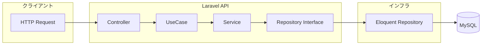
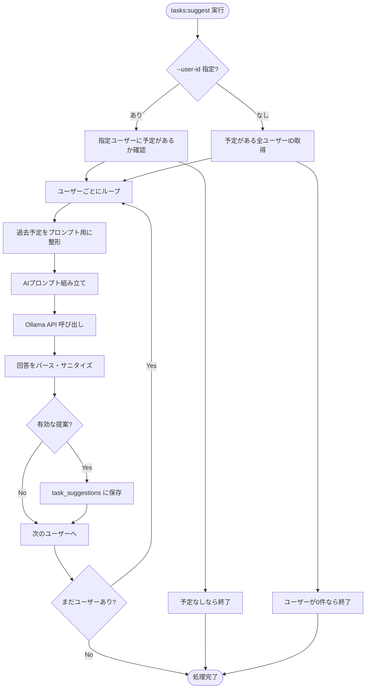
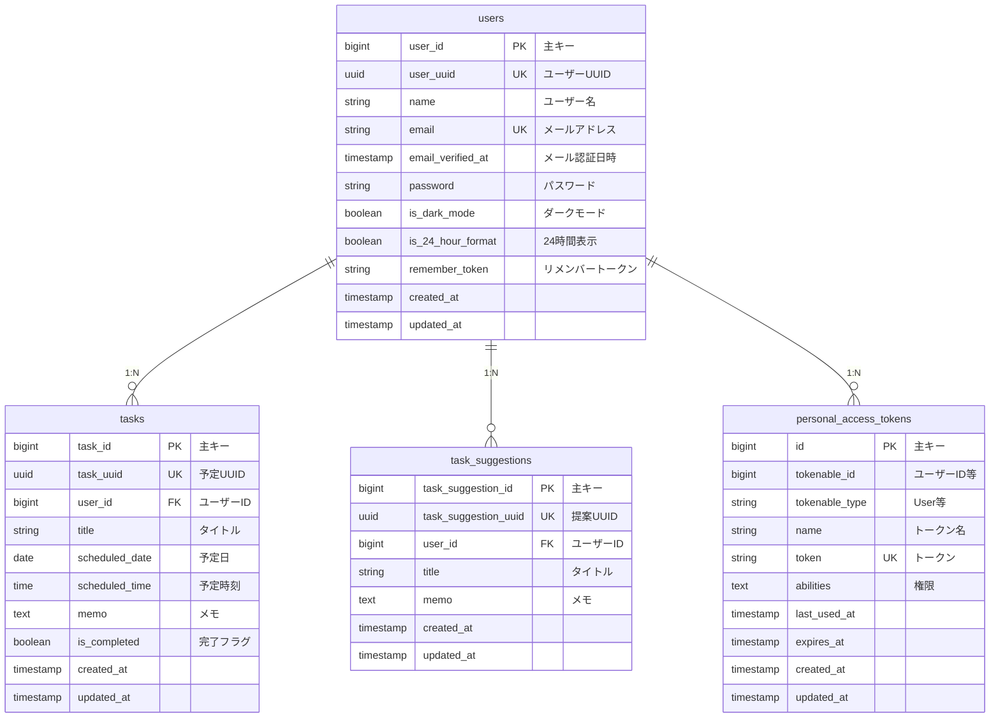

# Habit RPG API

AIがあなたの過去の行動から「続けられる習慣」を提案する、RPG風 習慣管理アプリのバックエンドAPI  
（ポートフォリオ）

## 概要

Habit RPG API は、習慣管理アプリ「Habit RPG App」を支えるバックエンド API です。

本プロジェクトの最大の特徴は、**Docker 上で稼働する LLM（大規模言語モデル）をバックエンドに組み込み、過去の行動データをもとに AI が習慣・予定を提案する点**です。

本 API は **AI 駆動開発の学習・実践** を目的とした個人ポートフォリオであり、
バックエンド（Laravel / Docker / AI 連携）を中心に、実務を想定した設計・構成を意識して開発しています。

## コンセプト

* 習慣化が苦手な人でも「ゲーム感覚」で続けられる
* 過去の行動履歴をもとに、無理のない現実的な習慣を AI が提案
* LLM を実サービス想定で扱うため、Docker 環境に AI を組み込んだ構成を採用

※ 現時点では RPG 要素に関する API は限定的ですが、
将来的な経験値・レベルシステムの追加を前提に、拡張しやすい設計を行っています。

## 主な機能

### 認証

* ログイン / ログアウト
* Laravel Sanctum によるトークンベース認証
* メールのワンタイムパスワードによる新規会員登録（送信 → 検証 → パスワード設定）

### 予定・習慣管理（Task）

* 作成 / 編集 / 削除
* 完了状態の切り替え
* 一覧取得

### AI による予定・習慣提案（Suggestion）

* 過去の予定データをもとに LLM が提案を生成
* プロンプト設計・生成処理は Laravel 側で実装
* Ollama（Docker コンテナ）と連携
* 提案生成はバッチ（Artisan コマンド）として実行

### ユーザープロフィール管理

* プロフィール取得 / 更新

## 用語定義

| 用語             | 説明                     |
| -------------- | ---------------------- |
| **Task**       | ユーザーが登録する予定・習慣の単位      |
| **Suggestion** | AI が生成した予定・習慣の提案       |
| **UseCase**    | アプリケーション操作単位（何をするか）    |
| **Service**    | ビジネスロジック単位（どのように実現するか） |

## システム構成（概要）

```
Flutter（フロントエンド）
        ↓ HTTP API
Laravel（バックエンド / API）
        ↓
LLM（Ollama）
        ↓
MySQL（データベース）
```

* Laravel：認証、予定管理、AI プロンプト生成、レスポンス整形
* MySQL：データ永続化
* Ollama：LLM による予定提案生成

Docker 環境の詳細については、以下を参照してください。

* [https://github.com/naostudy0/habit_rpg_docker](https://github.com/naostudy0/habit_rpg_docker)

## 技術スタック

* フレームワーク: Laravel 12.x
* 言語: PHP 8.2+
* 認証: Laravel Sanctum
* データベース: MySQL 8.0
* AI / LLM: Ollama
* テスト: PHPUnit
* コードフォーマット: Laravel Pint

## 設計方針（要約）

* API ファースト設計
* AI ロジックはバックエンドに集約
* レイヤードアーキテクチャ + ユースケース駆動
* フレームワーク非依存な Domain を中心に据えた設計

## アーキテクチャ概要

### レイヤ構成

```text
Controller → UseCase → Service → Repository Interface → 永続化
```

* **Controller**: 入出力の受け取り・バリデーション・レスポンス整形
* **UseCase**: アプリケーション操作単位のオーケストレーション（何をするか）
* **Service**: ビジネスロジック・トランザクション管理（どのように実現するか）
* **Domain**: Entity と Repository インターフェースのみを保持
* **Infrastructure**: DB / 認証 / 外部 API の具体実装

依存関係は **外側 → 内側** の一方向に統一しています。

### 処理の流れ（フローチャート）

#### API リクエスト（例: 予定作成）



#### AI 提案生成（バッチ: tasks:suggest）



### データベース ER 図



※ 認証・キャッシュ・ジョブ用の `password_reset_tokens`, `sessions`, `cache`, `jobs` は省略しています。

## プロジェクト構造

```text
app/
├── Console/          # Artisan コマンド（AI 提案バッチなど）
├── Domain/           # ドメイン層
│   ├── Entities/     # エンティティ
│   └── Repositories/ # リポジトリインターフェース
├── Http/
│   ├── Controllers/  # コントローラー
│   ├── Requests/     # フォームリクエスト
│   └── Resources/    # API レスポンス整形
├── Infrastructure/   # インフラ層
│   └── Repositories/ # Eloquent リポジトリ実装
├── Models/           # Eloquent モデル
├── Services/         # ビジネスロジック
├── UseCases/         # ユースケース層（Input / Output / Result）
└── Utils/            # ユーティリティ
```

## API レスポンス仕様（例）

### 成功時

```json
{
  "data": {
    "uuid": "xxxx-xxxx",
    "title": "朝の散歩"
  }
}
```

## 会員登録フロー（メールのワンタイムパスワード）

未登録メールアドレスに対して、以下の順で登録します。

1. ワンタイムパスワード送信: `POST /api/auth/register/otp/send`
1. ワンタイムパスワード検証: `POST /api/auth/register/otp/verify`
1. 本登録完了: `POST /api/auth/register/complete`

### 1. ワンタイムパスワード送信

* リクエスト: `email`
* 動作: 6桁のワンタイムパスワードを発行しメール送信
* 主な制御:
  * ワンタイムパスワード有効期限（デフォルト10分）
  * 再送クールダウン（デフォルト60秒）
  * 再送上限（デフォルト3回）
* 主な異常系:
  * 既存メールアドレス: `409`
  * 再送クールダウン中 / 再送上限超過: `429`

### 2. ワンタイムパスワード検証

* リクエスト: `email`, `otp`
* 動作: ワンタイムパスワード一致時に本登録用の短期トークンを返却（有効期限: デフォルト15分）
* 補足: トークン有効期限は `REGISTRATION_TOKEN_EXPIRES_MINUTES` で変更可能です。時刻判定はサーバー時刻（`APP_TIMEZONE`）基準で行います。
* 主な制御:
  * ワンタイムパスワード試行回数上限（デフォルト5回）
* 主な異常系:
  * 誤ったワンタイムパスワード / 期限切れ / 未発行: `422`
  * 試行回数超過: `429`

### 3. 本登録完了

* リクエスト: `registration_token`, `name`, `password`
* 動作: `users` にユーザー作成（`password` はハッシュ化、`email_verified_at` を設定）
* 主な異常系:
  * トークン不正/期限切れ: `422`
  * 既存メールアドレス: `409`

登録完了後は既存の `POST /api/auth/login` でログインできます。

### エラー時

```json
{
  "errors": [
    {
      "code": "INVALID_INPUT",
      "message": "入力が正しくありません"
    }
  ]
}
```

## セットアップ

### 1. 依存関係のインストール

```bash
composer install
```

### 2. 環境設定

```bash
cp .env.example .env
php artisan key:generate
```

### 3. マイグレーション

```bash
php artisan migrate
```

## テスト

```bash
# 全テスト
php artisan test

# ユニットテストのみ
php artisan test --testsuite=Unit
```

### CI（GitHub Actions）

* `pint --test` によるコードフォーマットチェック
* PHPUnit による自動テスト実行

## 今後の拡張予定

* AI を活用した経験値・レベルシステム
* 行動履歴を考慮した成長バランス調整
* AI 提案ロジックの差し替え（LLM 抽象化）

## ライセンス

本リポジトリは個人ポートフォリオ目的で公開しています。
